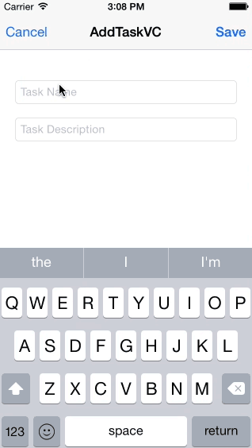

SwiftCoreDataPart2
==================

Swift, CoreData, TableView 

This is part 2 of our series on how to use CoreData in a Swift project. In this tutorial, we implement Core Data into our project via a few custom classes. Instead of using the dummy data from part 1 to populate our table view, we fill it with the content found stored by Core Data. Watch the video tutorial here: http://youtu.be/dJmiTzj3qmk

Check out part 1 here: <a href="http://youtu.be/I7n3t5eAkoo" target="_blank">Swift App Tutorial with Core Data - Part 1</a>

Check out part 3 here: <a href="" target="_blank">Swift App Tutorial with Core Data - Part 3</a>
